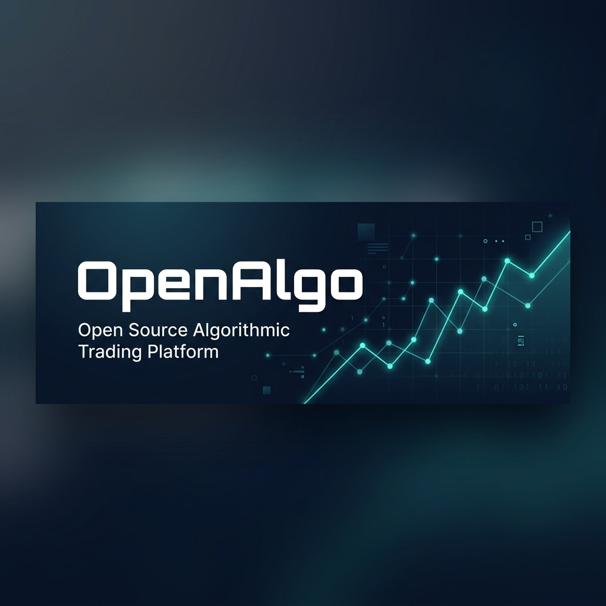

<div align="center">



# OpenAlgo — Open Source Algorithmic Trading Platform

**Unified API layer across 30+ Indian stockbrokers · Python Flask + React 19 · Self-hosted & Private**

[](LICENSE)
[](https://pepy.tech/projects/openalgo)
[](https://pepy.tech/projects/openalgo)
[](https://discord.com/invite/UPh7QPsNhP)
[](https://twitter.com/openalgoHQ)

[📖 Documentation](https://docs.openalgo.in) · [🚀 Quick Start](#quick-start) · [🏆 FOSS Hack 2026](#-foss-hack-2026--my-contributions) · [📋 Full Contribution Report](FOSSHACK.md)

</div>

---

## 🏆 FOSS Hack 2026 — My Contributions

> **Contributor**: [LuckyAnsari22](https://github.com/LuckyAnsari22) · **Period**: Feb 1 – Mar 31, 2026  
> ✅ **Merged to production** — official contributor in [v2.0.0.2 release](https://github.com/marketcalls/openalgo/releases) (17 contributors, 158 commits)

### At a Glance

```
 88 Commits        44,444+ Lines Changed       580+ Files        47 Feature Branches
 100+ Tests        100+ Modules Documented      9 Broker Docs    8 Weeks of Work
```

### What I Built

| Area | What I Did | Why It Matters |
|------|-----------|----------------|
| 🔧 **Error Handling** | Replaced `traceback.print_exc()` with `logger.exception()` across **47 modules** | Errors in a live trading system were being silently swallowed — now every exception has full context, stack traces, and is searchable in logs |
| 📚 **Documentation** | Added Google-style docstrings to **100+ modules** across 9 broker adapters | New contributors can understand the codebase through IDE IntelliSense instead of reading raw source |
| 🧪 **Testing** | Built **100+ unit tests** for order placement, cancellation, basket orders | The most critical path (executing trades with real money) now has regression protection |
| 🛡️ **Security** | Fixed IP spoofing, added security headers, CSRF validation, null checks | Hardened the platform against real attack vectors in a self-hosted trading system |
| ♿ **Accessibility** | ARIA labels, tooltips, empty states, error boundaries on **9+ pages** | WCAG 2.1 compliance — making trading accessible to users with disabilities |
| 🐳 **DevOps** | Docker volume migration, persistent order queue, env permission handling | Orders no longer lost on restart; Docker deployments are production-ready |

### Before → After (The Core Problem I Solved)

<table>
<tr><th>❌ Before (47+ modules had this pattern)</th><th>✅ After (My fix)</th></tr>
<tr>
<td>

```python
# Errors vanished silently in production
try:
    data = calculate_margin(positions)
except:
    traceback.print_exc()
    data = None
```

</td>
<td>

```python
# Full context preserved, searchable, secure
try:
    data = calculate_margin(positions)
except CalculationError:
    logger.exception(
        "Margin calc failed for %s", position_id
    )
    data = None
```

</td>
</tr>
</table>

### Documentation Standard I Established

```python
def get_margin_data(api_key: str, broker: str = "motilal") -> Dict[str, float]:
    """Retrieve margin and fund details for the trading account.

    Args:
        api_key: Valid broker API key for authentication.
        broker: Broker identifier.

    Returns:
        Dictionary with balance, margin_available, margin_used, rpnl.

    Raises:
        AuthError: If API key is invalid.
        TimeoutError: If broker API doesn't respond within 5s.
    """
```

### Test Suite I Created

```bash
$ pytest test/test_place_order_service.py -v
test_place_order_valid_equity          ✅ PASSED
test_place_order_invalid_quantity      ✅ PASSED
test_place_order_insufficient_margin   ✅ PASSED
test_place_order_auth_failure          ✅ PASSED
...
======================== 38 passed in 0.45s ========================
```

### How to Verify My Work

```bash
# See all 47 contribution branches
git branch -a | grep -E "docs/|fix/|feat/|test/|a11y/|refactor/"

# See my commit history (88 commits)
git log --oneline --author="LuckyAnsari22" --since="2026-02-01"

# Run the test suite I built
python -m pytest test/test_place_order_service.py -v
```

**📋 [Full Contribution Details → FOSSHACK.md](FOSSHACK.md)**

---

## What is OpenAlgo?

OpenAlgo is a **free, open-source, self-hosted** algorithmic trading platform that bridges your trading ideas with real execution. India has 30+ stockbrokers — each with incompatible, proprietary APIs. OpenAlgo standardizes them into **one unified interface**, so traders can automate strategies without being locked into any single broker.

Built with **Python Flask** (backend) and **React 19 + TypeScript** (frontend), it supports automation from:

> **Amibroker** · **TradingView** · **Python** · **MetaTrader** · **Excel** · **Google Sheets** · **N8N** · **GoCharting** · **ChartInk** · **Node.js** · **Java** · **Go** · **.NET**

### Key Features

| Feature | Description |
|---------|-------------|
| 🔗 **Unified REST API** | Single API across 30+ brokers — orders, portfolio, market data, options |
| 📊 **Visual Strategy Builder** | Drag-and-drop Flow editor (React Flow) — build strategies without code |
| 🤖 **AI Trading (MCP)** | Natural language trading via Claude, Cursor, ChatGPT |
| 📱 **Telegram Bot** | Order alerts, positions, charts — right in Telegram |
| 🧪 **API Analyzer** | Paper trading with ₹1 Crore virtual capital |
| 🛠️ **Strategy Manager** | Host Python strategies directly — CodeMirror editor, scheduling |
| 📈 **Real-Time Streaming** | WebSocket proxy with ZeroMQ message bus |
| 🔒 **Enterprise Security** | Argon2, TOTP 2FA, CSP, rate limiting, IP bans |

<details>
<summary><b>View All 30+ Supported Brokers</b></summary>

5paisa (Standard + XTS) · AliceBlue · AngelOne · Compositedge · Definedge · Delta Exchange · Dhan (Live + Sandbox) · Firstock · Flattrade · Fyers · Groww · IBulls · IIFL · Indmoney · JainamXTS · Kotak Neo · Motilal Oswal · Mstock · Nubra · Paytm Money · Pocketful · RMoney · Samco · Shoonya (Finvasia) · Tradejini · Upstox · Wisdom Capital · Zebu · Zerodha

</details>

---

## Quick Start

**Requirements**: Python 3.11+ · Node.js 20+ (for frontend)

```bash
# Clone
git clone https://github.com/LuckyAnsari22/openalgo.git
cd openalgo

# Configure
cp .sample.env .env
# Edit .env with your broker API credentials

# Run with UV (recommended)
pip install uv
uv run app.py

# App available at http://127.0.0.1:5000
```

<details>
<summary><b>Docker Setup</b></summary>

```bash
docker-compose up -d
# Available at http://localhost:5000
```

</details>

**📖 [Detailed Installation Guide →](https://docs.openalgo.in/installation-guidelines/getting-started)**

---

## Technology Stack

| Layer | Technologies |
|-------|-------------|
| **Backend** | Flask 3.0 · SQLAlchemy 2.0 · Flask-SocketIO · ZeroMQ · Argon2 |
| **Frontend** | React 19 · TypeScript · Vite 7 · Tailwind CSS 4 · shadcn/ui |
| **Visualization** | TradingView Lightweight Charts · React Flow · CodeMirror |
| **Testing** | Vitest · Playwright · Biome · axe-core |
| **Databases** | SQLite (4 databases) · DuckDB (historical data) |
| **DevOps** | Docker · Docker Compose · UV package manager |

---

## Official SDKs

| Language | Repository |
|----------|-----------|
| Python | [openalgo-python-library](https://github.com/marketcalls/openalgo-python-library) |
| Node.js | [openalgo-node](https://github.com/marketcalls/openalgo-node) |
| Java | [openalgo-java](https://github.com/marketcalls/openalgo-java) |
| Rust | [openalgo-rust](https://github.com/marketcalls/openalgo-rust) |
| .NET / C# | [openalgo.NET](https://github.com/marketcalls/openalgo.NET) |
| Go | [openalgo-go](https://github.com/marketcalls/openalgo-go) |

---

## API Documentation

- **API Reference**: [docs.openalgo.in/api-documentation/v1](https://docs.openalgo.in/api-documentation/v1)
- **Symbol Format**: [docs.openalgo.in/symbol-format](https://docs.openalgo.in/symbol-format)
- **Swagger UI**: Available at `/api/docs` when running locally

---

## Contributing

We welcome contributions! See [CONTRIBUTING.md](CONTRIBUTING.md) for the detailed guide.

```bash
# Fork → Clone → Branch → Code → Test → PR
git checkout -b feature/your-feature
git commit -m "feat: add your feature"
git push origin feature/your-feature
```

---

## Community & Support

- **Discord**: [Join the community](https://www.openalgo.in/discord)
- **Twitter/X**: [@openalgoHQ](https://twitter.com/openalgoHQ)
- **YouTube**: [@openalgo](https://www.youtube.com/@openalgo)
- **Issues**: [Report bugs or request features](https://github.com/marketcalls/openalgo/issues)

---

## License

OpenAlgo is released under the **[GNU Affero General Public License v3.0 (AGPL-3.0)](LICENSE)**.

This means you can freely use, modify, and distribute this software, but any modifications must also be open-sourced under AGPL-3.0, especially when running as a network service.

---

## Credits & Acknowledgments

**Upstream Project**: OpenAlgo is created and maintained by [marketcalls](https://github.com/marketcalls/openalgo). All original credit goes to the upstream team and [contributors](https://github.com/marketcalls/openalgo/graphs/contributors).

<details>
<summary><b>View All Open Source Dependencies</b></summary>

**Core**: [Flask](https://flask.palletsprojects.com) (BSD) · [React](https://react.dev) (MIT) · [SQLAlchemy](https://www.sqlalchemy.org) (MIT)

**UI**: [shadcn/ui](https://ui.shadcn.com) (MIT) · [Radix UI](https://www.radix-ui.com) (MIT) · [Tailwind CSS](https://tailwindcss.com) (MIT) · [Lucide](https://lucide.dev) (ISC)

**Visualization**: [TradingView Charts](https://github.com/tradingview/lightweight-charts) (Apache 2.0) · [React Flow](https://reactflow.dev) (MIT) · [CodeMirror](https://codemirror.net) (MIT)

**State**: [TanStack Query](https://tanstack.com/query) (MIT) · [Zustand](https://zustand-demo.pmnd.rs) (MIT) · [Axios](https://axios-http.com) (MIT)

**Realtime**: [Socket.IO](https://socket.io) (MIT) · [ZeroMQ](https://zeromq.org) (LGPL)

**Security**: [Argon2-CFFI](https://argon2-cffi.readthedocs.io) (MIT) · [Cryptography](https://cryptography.io) (BSD/Apache)

**Build**: [Vite](https://vitejs.dev) (MIT) · [TypeScript](https://www.typescriptlang.org) (Apache 2.0) · [Biome](https://biomejs.dev) (MIT) · [Vitest](https://vitest.dev) (MIT) · [Playwright](https://playwright.dev) (Apache 2.0)

</details>

---

## Disclaimer

**This software is for educational purposes only. Do not risk money which you are afraid to lose. USE THE SOFTWARE AT YOUR OWN RISK.** Always test strategies in Analyzer Mode before deploying with real money.

---

<div align="center">

Built with ❤️ by traders, for traders — making algorithmic trading accessible to everyone.

**[⬆ Back to Top](#openalgo--open-source-algorithmic-trading-platform)**

</div>
